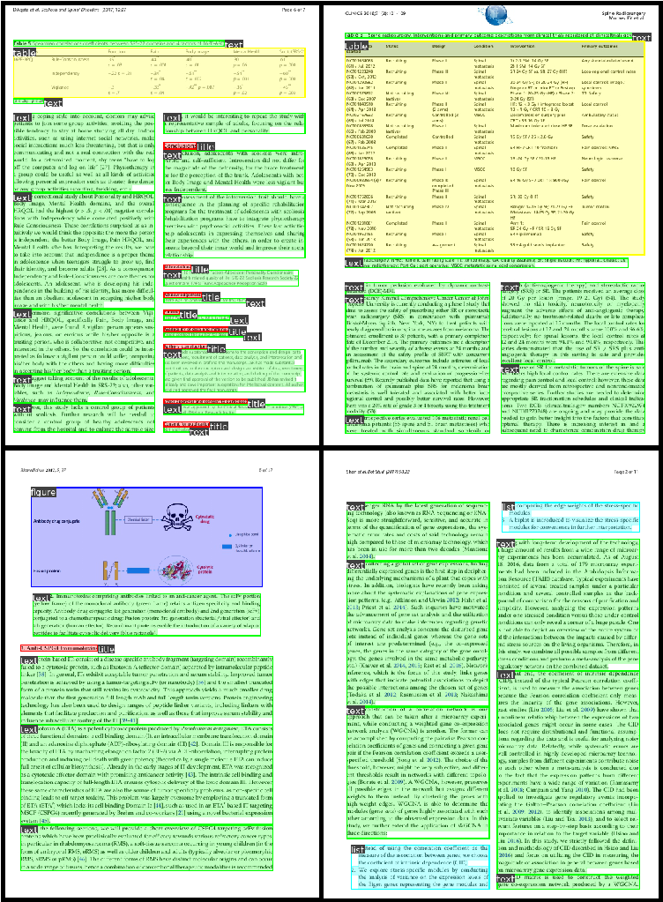

# Scaled_YOLO_v4 \(tuned for documents detection\)

This repository is a version of the [ScaledYOLOv4](https://github.com/WongKinYiu/ScaledYOLOv4/tree/yolov4-large) repository specially enhanced for documents \(like scientific papers\) elements detection.

<p align="center">
    
</p>

## Classes
For this task, I took the general list of classes from the *PubLayNet* dataset:
* `text` - plain text that is not bold, such as paragraph, equation, footer, date, etc.
* `title` - highlighted short text, such as caption, section title, author, etc. Usually describe something
* `list` - any data in the form of a list
* `table` - any data in the form of a table
* `figure` - any pictures data, such as schemes, diagrams, charts, photos, etc.

## Dataset
Existed *documents_pretrain_2mln.pt* model was trained by 10 epochs on 2195191-images dataset, built from this open-sourse datasets:  
* [PubLayNet](https://github.com/ibm-aur-nlp/PubLayNet) \(default classes\)
* [DocBank](https://github.com/doc-analysis/DocBank/) \(default classes are brought to the target form\)
* [IIIT-AR-13K](http://cvit.iiit.ac.in/usodi/iiitar13k.php) \(only crops of figures and tables on a background filled with the most common color of the default image\)
* [ChartReader](https://github.com/Cvrane/ChartReader) \(only crops of figures on a background filled with the most common color of the default image\)
* [DeepRule](https://github.com/soap117/DeepRule) \(only crops of figures on a background filled with the most common color of the default image\)
* [PubTabNet](https://github.com/ibm-aur-nlp/PubTabNet) \(only crops of tables on a background filled with the most common color of the default image\)
* [TableBank](https://github.com/doc-analysis/TableBank) \(only crops of tables on a background filled with the most common color of the default image\)

## Test metrics \(10 epochs\)
Test set consisted of 182708 random samples from full dataset.

| Class |    Targets    | P | R | mAP@.5 | mAP@.5:.95 |
| :----: | :-----------------: | :----: | :----: | :----: | :----: |
| all | 1080000 | 0.895 | 0.851 | 0.831 | 0.752 |
| text | 764000 | 0.873 | 0.78 | 0.762 | 0.662 |
| title | 142000 | 0.926 | 0.812 | 0.792 | 0.67 |
| list | 46500 | 0.789 | 0.826 | 0.776 | 0.706 |
| table | 65700 | 0.974 | 0.963 | 0.964 | 0.952 |
| figure | 63300 | 0.913 | 0.876 | 0.861 | 0.771 |

You can use the [resulting weights](https://drive.google.com/file/d/1IZqus8mphGu54nOSsqgOJ2Igj70Ex_dN/view?usp=share_link) as a good pretrain for many different document detection tasks.

## Changes added to the default [*ScaledYOLOv4*](https://github.com/WongKinYiu/ScaledYOLOv4/tree/yolov4-large)

<details><summary> <b>Expand</b> </summary>

* code for inference via *triton server*
* *ColorJitter*, *GaussNoise*, *InvertImg* and *RGBShift* augmentations from *albumentations*, *mosaic* augmentation options moved to all options config
* tuned hyperparameters especially for document detection task
* drawing anchors grid
* *wandb* logging
* layers freeze option
* *MishCuda* activation changed to *nn.Mish()*
* shuffle option for dataloader
* removed unnecessary saving of the last 30 epochs
* small code changes to work correctly with torch>=1.9
* fixed *random_perspective()* function to be able to work with narrow and long bboxes, as well as for correct learning with disabled *mosaic* and *scale* augmentations
* option to select the number of iterations *evolve*

</details>

### Get started ###

```
pip install -r requirements.txt
```
### Train ###

```
python train.py --batch 14 --img 640 --epochs 300 --data './data/config.yaml' --hyp './data/hyp.finetune.yaml' --cfg ./models/yolov4-csp.yaml --weights './weights/documents_pretrain_2mln.pt' --name lets_train --cache --freeze
```

### Test ###

```
python test.py --weight './weights/documents_pretrain_2mln.pt' --data './data/config.yaml' --batch-size 28 --img-size 640 --conf-thres 0.5 --iou-thres 0.5 --task 'test' --verbose
```

### Draw result bboxes ###

```
python detect.py --weights './weights/documents_pretrain_2mln.pt' --img 640 --conf 0.5 --source folder_with_images
```

## ONNX export

* Put model weights in *./weights*
* Assign the path to them to the *WEIGHTS_PT* variable in *./app/settings.py*
* Run *./app/export.py*
* The onnx model is stored at the address specified in the *WEIGHTS_ONNX* variable in *./app/settings.py*

## Launch Triton Inference Server

* If necessary, change the values of the *TRITON_URL*, *MODEL_NAME* and *MODEL_VERSION* variables in *./app/settings.py*
* Place in *./triton_models/detector* the *config.pbtxt* file for the triton model of the corresponding version
* Start the docker container with a command like
```
docker run --gpus=0 --rm -p9005:8001 -v /home/triton_models:/models nvcr.io/nvidia/tritonserver:21.08-py3 tritonserver --model-repository=/models
```
* Check the server by running *./triton_scripts/test_triton_server.py* - if everything is OK, you will get the message *"Well done! Triton model result is equal to pytorch model result."*
